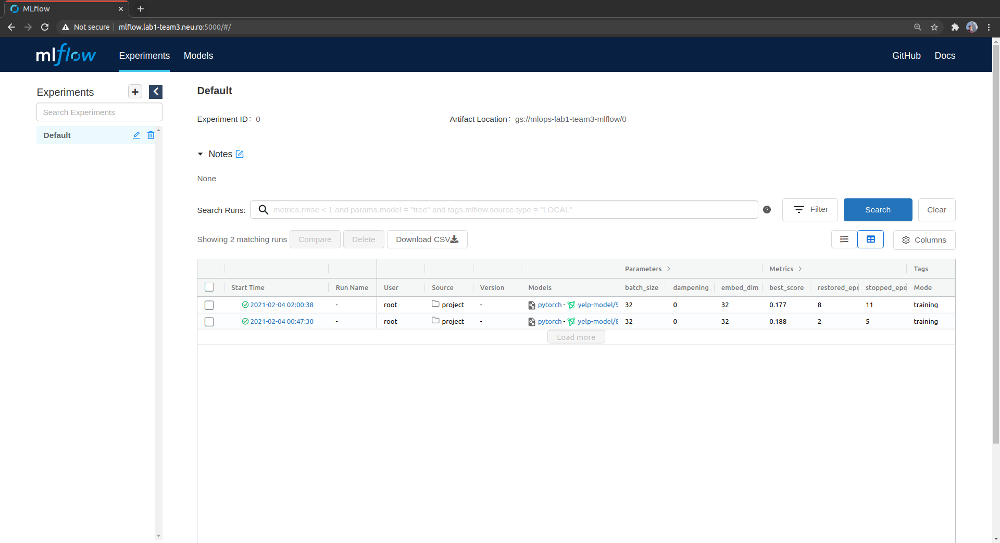

MLOps Community Lab 1: Team 3: Yelp Review Classification
=========================================================

# Awesome MLOps Community
[MLOps Community](https://mlops.community/) :tada: is an open, free and transparent place for MLOps practitioners can collaborate on experiences and best practices around MLOps (DevOps for ML).

# Awesome Labs Initiative

[Labs Initiative](https://github.com/mlopscommunity/engineering.labs) is an educational project pursuing [three goals](https://mlops-community.slack.com/archives/C0198RL5Y01/p1607941366069400):
1. have fun :partying_face:
2. learn :nerd_face:
3. share :handshake:

# Awesome Lab 1
The [first lab](https://github.com/mlopscommunity/engineering.labs/tree/master/Lab1_Operationalizing_Pytorch_with_Mlflow) was about integration of [PyTorch](https://pytorch.org/) with [MLflow](https://mlflow.org/). The ML problem to tackle was a free choice.

## Model Development
Our team chose the Review classification problem based on [Yelp Dataset](https://www.yelp.com/dataset). The data consists of the list of reviews on restaurant, museums, hospitals, etc., and the number of stars associated with this review (0-5). We model this task as a classification problem: is the review positive (has >=3 stars) or negative (has <3 stars). Following the [torchtext tutorial](https://pytorch.org/tutorials/beginner/text_sentiment_ngrams_tutorial.html), we implemented a model consisting of 2 layers: `EmbeddingBag` and the linear layer. Please find the code in [./src](./src). Many thanks to @paulomaia20 for handling this part :pray:.

## Web UI
First of all, we implemented a small web UI with [Streamlit](https://www.streamlit.io/) that defined the final goal of the project:


## Infrastructure
We absolutely :heart: [Kubernetes](https://kubernetes.io/). And for this task, we couldn't resist not to use it. So we created a kubernetes cluster in GCP (thanks Google for [$300 free credit](https://cloud.google.com/free)), used [helm charts](https://larribas.me/helm-charts) to deploy MLflow server backed by managed PostgreSQL database as backend store and GCS bucket as artifact store. All services were exposed via public IP (thanks [Neu.ro](https://neu.ro) for adding the A-records into their DNS table for getting cool `.neu.ro` domain names!). See [./gcp](./gcp) for details. Thanks @artem-yushkovsky for setting this up!

```bash
$ kubectl -n mlflow get all             
NAME                          READY   STATUS    RESTARTS   AGE
pod/mlflow-57c5fcd4df-52bbd   1/1     Running   0          16h

NAME             TYPE           CLUSTER-IP     EXTERNAL-IP     PORT(S)          AGE
service/mlflow   LoadBalancer   10.104.0.146   34.91.123.207   5000:31243/TCP   11d

NAME                     READY   UP-TO-DATE   AVAILABLE   AGE
deployment.apps/mlflow   1/1     1            1           11d

NAME                                DESIRED   CURRENT   READY   AGE
replicaset.apps/mlflow-57c5fcd4df   1         1         1       16h
replicaset.apps/mlflow-7686588c6b   0         0         0       11d
```

```bash
$ kubectl -n mlflow-model get all
NAME                                        READY   STATUS    RESTARTS   AGE
pod/mlflow-model-operator-9c7fbd88b-tcx5j   3/3     Running   0          14h
pod/mlflow-model-proxy-646d4f9cd6-9xtmc     1/1     Running   0          18h
pod/mlflow-model-server-6f46cdd48f-85zxq    1/1     Running   0          14h

NAME                            TYPE           CLUSTER-IP      EXTERNAL-IP    PORT(S)        AGE
service/mlflow-model-operator   LoadBalancer   10.104.2.23     34.91.157.40   80:32328/TCP   15h
service/mlflow-model-proxy      LoadBalancer   10.104.14.129   34.91.75.82    80:31813/TCP   19h
service/mlflow-model-server     ClusterIP      10.104.5.80     <none>         80/TCP         20h

NAME                                    READY   UP-TO-DATE   AVAILABLE   AGE
deployment.apps/mlflow-model-operator   1/1     1            1           14h
deployment.apps/mlflow-model-proxy      1/1     1            1           18h
deployment.apps/mlflow-model-server     1/1     1            1           14h

NAME                                              DESIRED   CURRENT   READY   AGE
replicaset.apps/mlflow-model-operator-9c7fbd88b   1         1         1       14h
replicaset.apps/mlflow-model-proxy-646d4f9cd6     1         1         1       18h
replicaset.apps/mlflow-model-server-6f46cdd48f    1         1         1       14h
```

## Model training
Unfortunately, GCP free tier account doesn't include GPU resources to train models. Fortunately, there exist many other places where you can get computational resources for free. Thanks to [NILG.AI](https://nilg.ai/) for providing their servers to develop the model, and thanks to [Neu.ro](https://neu.ro) with their free $100 GPU quota we used to train the model. Please find the scripts in [./scripts/neuro](./scripts/neuro).

```bash
+ neuro run --name yelp-train --preset gpu-small-p --volume storage:yelp_dataset:/project:rw --volume secret:bucket-sa-key:/opt/developers-key.json --env PYTHONPATH=/project --env GOOGLE_APPLICATION_CREDENTIALS=/opt/developers-key.json --env MLFLOW_TRACKING_URI=http://mlflow.lab1-team3.neu.ro:5000 --env GIT_PYTHON_REFRESH=quiet --detach gcr.io/mlops-lab1-team3/yelp-dataset/model:v1.0 mlflow run /project --no-conda -P max_epochs=15
√ Job ID: job-1676f810-0d1c-47ff-8b82-00d5a4bb35c2
√ Name: yelp-train
- Status: pending Creating
- Status: pending Scheduling
- Status: pending ClusterScalingUp (Scaling up the cluster to get more resources)
- Status: pending Initializing
- Status: pending ContainerCreating
√ Http URL: https://yelp-train--artemyushkovskiy.jobs.neuro-compute.org.neu.ro
√ The job will die in a day. See --life-span option documentation for details.
√ Status: running                                                                              
+ echo

+ echo 'Server is running, please DO NOT FORGET TO KILL IT: '\''neuro kill yelp-train'\'''
Server is running, please DO NOT FORGET TO KILL IT: 'neuro kill yelp-train'
+ echo

+ neuro logs yelp-train
2021/02/04 20:14:55 INFO mlflow.projects.utils: === Created directory /tmp/tmp80iddg3c for downloading remote URIs passed to arguments of type 'path' ===
2021/02/04 20:14:55 INFO mlflow.projects.backend.local: === Running command 'python3 -u src/train.py --n_grams 1 --batch_size 32 --embed_dim 32 --max_epochs 15' in run with ID '59e1f3764f6f44d9aeea13e10395ea5d' === 
2021-02-04 20:14:58,124 - INFO - utils.py:download_from_url - Downloading from Google Drive; may take a few minutes
2021-02-04 20:14:59,451 - INFO - utils.py:_process_response - Downloading file yelp_review_polarity_csv.tar.gz to ../data/yelp_review_polarity_csv.tar.gz.
yelp_review_polarity_csv.tar.gz: 166MB [00:02, 57.8MB/s] 
2021-02-04 20:15:02,330 - INFO - utils.py:_process_response - File ../data/yelp_review_polarity_csv.tar.gz downloaded.
2021-02-04 20:15:02,330 - INFO - utils.py:extract_archive - Opening tar file ../data/yelp_review_polarity_csv.tar.gz.
2021-02-04 20:15:06,128 - INFO - text_classification.py:_setup_datasets - Building Vocab based on ../data/yelp_review_polarity_csv/train.csv
560000lines [01:03, 8808.98lines/s]
2021-02-04 20:16:11,081 - INFO - text_classification.py:_setup_datasets - Vocab has 464400 entries
2021-02-04 20:16:11,082 - INFO - text_classification.py:_setup_datasets - Creating training data
560000lines [01:55, 4868.63lines/s]
2021-02-04 20:18:06,112 - INFO - text_classification.py:_setup_datasets - Creating testing data
38000lines [00:07, 4922.04lines/s]
2021-02-04 20:18:13,834 - INFO - train.py:main - Creating average embedding model
2021-02-04 20:18:17,085 - INFO - train.py:main - Saving vocabulary to /tmp/tmpu_zkipr2/vocab.pkl
GPU available: True, used: True
TPU available: None, using: 0 TPU cores
LOCAL_RANK: 0 - CUDA_VISIBLE_DEVICES: [0]
2021-02-04 20:18:20,847 - INFO - train.py:main - run_id: 59e1f3764f6f44d9aeea13e10395ea5d
2021/02/04 20:18:22 INFO mlflow.utils.autologging_utils: pytorch autologging will track hyperparameters, performance metrics, model artifacts, and lineage information for the current pytorch workflow to the MLflow run with ID '59e1f3764f6f44d9aeea13e10395ea5d'

  | Name      | Type         | Params
-------------------------------------------
0 | embedding | EmbeddingBag | 14.9 M
1 | fc        | Linear       | 66    
-------------------------------------------
14.9 M    Trainable params
0         Non-trainable params
14.9 M    Total params
Epoch 6:  16% 3040/18688 [00:19<01:42, 152.61it/s, loss=0.186, v_num=5]  
```

## Model and Experiment tracking
Thanks MLflow team such a cool product! It's really useful to have all the information in one place:



The developed models and their metadata is stored in GCS bucket `gs://mlops-lab1-team3-mlflow` (public read), the experiments metadata (parameters, metrics, etc.) is stored in PostgreSQL.


## Model Server
To serve the models, we implemented a small [FastAPI](https://fastapi.tiangolo.com/)-based service that loads the Pytorch pickled model from the local FS and serves it via simple REST API:

```bash
$ kubectl -n mlflow-model port-forward pod/mlflow-model-server-6f46cdd48f-85zxq 8080:8080
Forwarding from 127.0.0.1:8080 -> 8080
Forwarding from [::1]:8080 -> 8080
...

$ curl -X POST -H "Content-Type: application/json" -d '{"text": "very cool restaurant!"}' http://localhost:8080/predict | jq
{
  "text": "very cool restaurant!",
  "is_positive_review": 1,
  "details": {
    "mlflow_run_id": "3acade02674549b19044a59186d97db4",
    "inference_elapsed": 0.0006744861602783203
  }
}
```
This service is running in Kubernetes as a 1-replica deployment with a service providing load balancing with a static internal IP, so, if needed, it can be easily scaled horizontally. Thanks @artem-yushkovsky :tada:

## Model Proxy


## Awesome Team 3
- [Artem Yushkovskiy (@artem-yushkovsky)](https://github.com/artem-yushkovsky)
- [Paulo Maia (@paulomaia20)](https://github.com/paulomaia20)
- [Dimitrios Mangonakis (@dmangonakis)](https://github.com/dmangonakis)
- [Laszlo Sragner (@xLaszlo)](https://github.com/xLaszlo)

